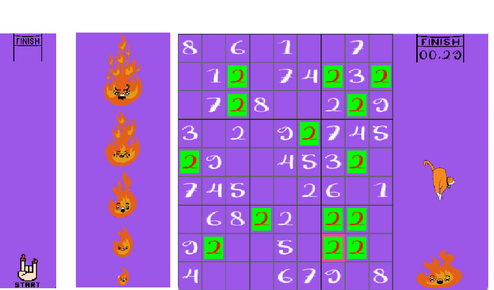

# Présentation d'un projet de Sudoku en C

## Objectif : Réussir en 3 semaines en partant d'une base de quasiment 0 à coder un Sudoku en C.

### Merci à rle-ru (https://github.com/rle-ru) (ne vous fiez pas a son git cette homme est une machine de guerre) et clement-caillat notre formateur durant ces 3 mois et demi a La_Plateforme pour la formation AWS (https://github.com/clement-caillat) nos senseï qui nous ont accompagnés durant ces 3 semaines.
### Projet réalisé en collaboration avec Dhjali ma binome pour les 3 prochaines années de formations (si elle me supporte jusque là) (https://github.com/Dhjali).

Première étapes notre construction d'une grille:


Viens ensuite la génération d'un soduku valide:


Nous avons passé quelque temps a faire de l'algorythmie afin de faire un Sudoku plus "humain" vous trouverez ces quelques "merveilles" dans le dossier Solver_humain en voilà l'exemple le plus simple:

```
int celib_nu(sudoku *sudoku_tab)
{
    int collect_true;
    int last;
    int return_value = 0;

    for (int i = 0; i < 9; i++)
    {
        for (int j = 0; j < 9; j++)
        {
            if (sudoku_tab->gridClone[i][j] == 0)
            {
                collect_true = 0;

                for (int n = 1; n < 10; n++)
                {
                    if (sudoku_tab->gridass[i][j][n - 1] == TRUE)
                    {
                        collect_true++;
                        last = n;
                    }
                }
                if (collect_true == 1)
                {
                    sudoku_tab->gridClone[i][j] = last;
                    return_value++;
                }
            }
        }
    }
    return return_value;
}
```

Afin que le générateur de Sudoku soit efficace il nous aurait fallu faire 7, 8 voir 9 fonctions différentes et par manque de temps nous avons décidé de repasser sur le rendu visuel et nous sommes laissé emporté par notre imagination en voiçi quelques features:



Bien sur le résultat final n'est pas parfait mal le but était bien de s'en tenir au 3 semaines et pas une minutes de plus.


